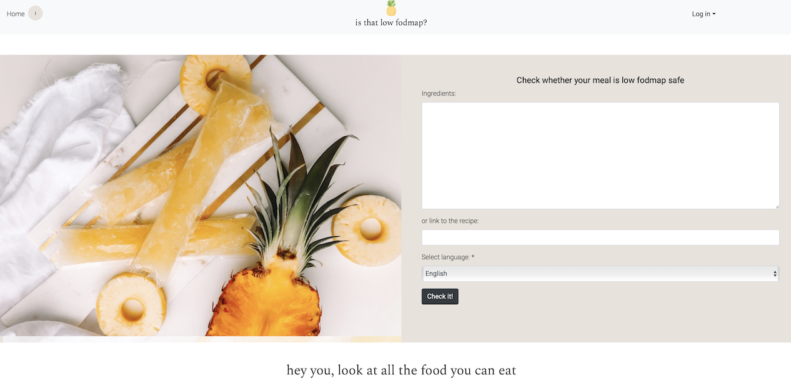

# Is that low fodmap?

See it live: https://isthatlowfodmap.herokuapp.com 
 (since it's on free heroku, give it a second to load) 

## Table of contents
* [General info](#general-info)
* [Technologies](#technologies)

## General info
This project is made to check if a recipie is OK for people on low FODMAP diet.
Users can add their own products, or links to recipies they like to check the safety of them.
They can make their collections and save recipies added by others.
They are then presented with a table of recognized products and their safety in low FODMAP diet.
For now it works for English and Polish ingredients.
I'm still working on tihs project, with many enhancements planned.

	
## Technologies
Python3
BeautifulSoup
Django2
HTML, CSS, Boostrap

